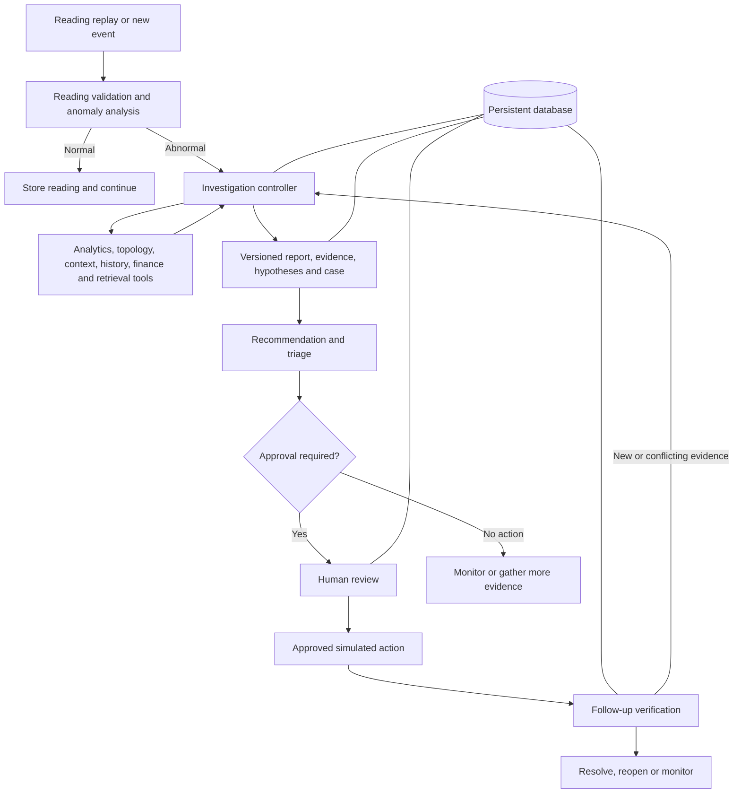

[README.md](https://github.com/user-attachments/files/32920981/README.md)
# MeterDetective AI

**Evidence-led smart-meter investigation, human-controlled action, and outcome verification.**

MeterDetective AI helps utility operations teams turn unusual consumption readings into structured operational cases. It brings together analytical evidence, competing explanations, recommendations, approval-controlled simulated actions, and follow-up verification.

> An anomaly is a reason to investigate—not proof of fraud, misconduct, or a definitive physical root cause.

**Recognition:** Reported recipient of the **#3 Best Project Award for Excellence in Agentic AI Development** in **Agentic AI with Vibe Coding**.

> **Review status:** This standalone README is based on the supplied 10-day execution plan, final two-day submission plan, and project conversation. It has not been checked against source code. The final plan explicitly reports an existing foundation of persistent cases, reports, evidence, hypotheses, financial and triage calculations, approval-gated actions, simulated repair, verification, a case queue, a case-detail workspace, and persistent activity history. Remaining demo behavior, exact dependencies, commands, and test results require implementation confirmation. Plans and acceptance criteria are not treated as proof of completed features.

## Contents

- [Overview](#overview)
- [Problem](#problem)
- [Key features and delivery status](#key-features-and-delivery-status)
- [Architecture](#architecture)
- [Analytics and evidence tools](#analytics-and-evidence-tools)
- [18-question investigation framework](#18-question-investigation-framework)
- [Demonstration scenarios](#demonstration-scenarios)
- [Human approval and verification](#human-approval-and-verification)
- [Responsible AI](#responsible-ai)
- [Data](#data)
- [Tech stack](#tech-stack)
- [Setup and run](#setup-and-run)
- [Environment variables](#environment-variables)
- [Testing and evaluation](#testing-and-evaluation)
- [Project structure](#project-structure)
- [Limitations](#limitations)
- [Future work](#future-work)
- [Team](#team)
- [Award recognition](#award-recognition)

## Overview

The primary user is a utility operations analyst or supervisor investigating whether a consumption change is concentrated at one meter, shared across a network area, caused by unreliable readings, or consistent with available contextual evidence.

The product's target journey is:

**Reading arrives → anomaly detected → investigation starts → evidence gathered → explanations compared → case created or updated → next step recommended → human approval → simulated action → follow-up verification.**

A second defining journey is evidence-driven replanning: an initially plausible individual-meter explanation is reconsidered when related-meter and transformer evidence supports a shared incident. Earlier findings and recommendations remain available for review.

This is a demonstration-oriented investigation assistant. It does not control real utility equipment.

## Problem

An anomaly score alone does not explain what happened, how widespread it is, which explanations are credible, or whether a response worked. Analysts need a case that connects readings to evidence, uncertainty, operational impact, and a controlled next step.

MeterDetective AI is designed to close that gap through a persistent investigation workflow rather than an isolated alert. Financial exposure and queue priority support decisions; they do not establish audited losses or legal liability.

## Key features and delivery status

### Existing foundation reported in the final plan

- Persistent cases and investigation reports.
- Evidence records and competing hypotheses.
- Financial-impact and triage calculations.
- Approval-gated actions and simulated repair.
- Post-action verification.
- A case queue and case-detail workspace.
- Persistent activity history.

These are reported capabilities, not independently verified implementation results.

### Defined scope requiring final implementation confirmation

- Reading replay that automatically starts or resumes an investigation.
- Data-quality checks, hybrid anomaly analysis, historical baselines, and forecasts.
- Dynamic peers, topology, shared-incident analysis, and transformer energy reconciliation.
- Weather and customer/solar/EV/load context with explicit uncertainty.
- Technical-document retrieval with citations and meter-specific precedents.
- A validated, versioned 18-question report.
- Evidence-driven plan changes, superseded recommendations, and duplicate-event protection.
- A plain-language live investigation timeline and dependency-readiness display.
- Graceful handling of missing evidence and external-service failures.

The final plan prioritizes repeatable demonstrations over adding features. PDF export, optional narrative generation, additional filters, and visual polish are not asserted as completed capabilities.

## Architecture

The following is the architecture defined by the supplied plans. Exact module boundaries and orchestration choices must be checked against the repository.



### Design principles

- **Deterministic calculations:** tools calculate numerical results; model-generated arithmetic is not accepted as evidence.
- **Explicit state:** preserve the trigger, goal, evidence, hypotheses, tool outcomes, missing information, recommendation, approval, and verification result.
- **Versioned reasoning:** retain earlier reports and plans when new evidence changes the investigation.
- **Human control:** consequential simulated actions require approval.
- **Durable history:** persistence is essential; the plan rejects silent in-memory fallback when the database is unavailable.

The initial plan proposes an LLM for tool selection and evidence interpretation through a constrained workflow. The final plan allows optional narrative generation. The exact runtime role of the LLM—and whether the final build uses LangGraph or a custom state machine—remains to be confirmed.

### Operator experience

The final interface plan centers on **Live Operations**, **Case Queue**, **System Status**, and an optional **Meter Explorer**. Case details present charts, evidence, hypotheses, recommendations, impact, priority, citations, verification, and history.

Normal views should use operational language. Developer identifiers, raw JSON, stack traces, and provider errors belong outside the default user flow. Interface completion has not been independently checked.

## Analytics and evidence tools

The 10-day plan defines the following **20-tool contract**. This is the planned catalog; reconcile it with the actual registered tools before publishing it as an implementation inventory.

| # | Tool | Purpose |
| ---: | --- | --- |
| 1 | `get_meter_profile` | Retrieve meter metadata and network association. |
| 2 | `get_reading_window` | Retrieve time-bounded consumption readings. |
| 3 | `validate_reading_quality` | Check gaps, duplicates, impossible values, and flatlines. |
| 4 | `calculate_baseline` | Calculate historical/seasonal expected behavior and robust deviation. |
| 5 | `detect_anomaly` | Combine interpretable rules and the planned Isolation Forest score. |
| 6 | `forecast_expected_usage` | Produce an expected consumption range. |
| 7 | `select_dynamic_peers` | Select comparable meters using metadata and recent load shape. |
| 8 | `compare_with_peers` | Assess relative deviation and shared patterns. |
| 9 | `get_connected_assets` | Retrieve transformer and related-meter connections. |
| 10 | `detect_shared_incident` | Assess whether an incident is local or group-wide. |
| 11 | `calculate_energy_balance` | Compare transformer input with downstream totals and expected losses. |
| 12 | `get_weather_context` | Retrieve weather aligned to the incident period. |
| 13 | `analyze_customer_der_context` | Examine available behavior, solar, EV, occupancy, and load-change evidence. |
| 14 | `search_technical_knowledge` | Retrieve relevant document passages with source metadata and citations. |
| 15 | `find_meter_precedents` | Retrieve exact-meter history first, then clearly separated similar cases. |
| 16 | `estimate_revenue_at_risk` | Estimate low/base/high JOD exposure with explicit assumptions. |
| 17 | `calculate_triage_priority` | Calculate priority score, band, and rank among active incidents. |
| 18 | `create_case_and_record_investigation` | Persist the case, report, evidence, hypotheses, and priority transactionally. |
| 19 | `propose_action_for_approval` | Propose an approval-controlled simulated action. |
| 20 | `verify_case_outcome` | Assess follow-up readings and update the case outcome. |

The contract requires typed inputs and outputs, execution status, latency, error handling, and evidence provenance. Unknown or unavailable inputs must not become invented results.

### Revenue at Risk

The planned estimate for a consumption-drop event is:

```text
expected_missing_kwh = max(0, expected_kwh - reliable_observed_kwh)
base_risk_jod = expected_missing_kwh × tariff_jod_per_kwh × recoverability_factor
```

All energy values must cover a consistent period. Any duration projection must be documented separately. Energy-balance incidents require an allocatable unexplained-energy estimate, with safeguards against double-counting linked meter and transformer cases.

The output contract includes low/base/high JOD values, energy estimates, tariff source and version, duration, recoverability, confidence, sensitivity drivers, and calculation time. A missing valid tariff makes the financial answer **Unknown**. Unreliable readings require an expected range rather than an assertion of confirmed lost energy.

This is decision support, not an invoice, audited loss, penalty estimate, or determination of liability.

### Triage

The initial plan proposes a versioned score from 0–100:

| Component | Weight |
| --- | ---: |
| Technical severity | 25 |
| Affected scope | 20 |
| Revenue at Risk | 20 |
| Persistence and precedent | 10 |
| Upstream/shared-network evidence | 10 |
| Evidence quality | 10 |
| Waiting time / SLA aging | 5 |

Suggested bands are **P1 ≥80**, **P2 60–79**, **P3 35–59**, and **P4 <35**. These are proposed demonstration policy values, not validated utility operating standards. Actual normalization and thresholds require code confirmation.

Active rank and percentile may change as other incidents open, close, or escalate. Preserve earlier assessments and their policy versions for review.

## 18-question investigation framework

The supplied plan defines these exact questions as the canonical investigation contract:

| # | Required question |
| ---: | --- |
| 1 | What happened? |
| 2 | How abnormal is it? |
| 3 | Is the data itself reliable? |
| 4 | Is this meter alone affected? |
| 5 | Are nearby or related meters affected? |
| 6 | Can weather explain the change? |
| 7 | Could customer behavior explain it? |
| 8 | Could solar, EV, or other load changes explain it? |
| 9 | Is there an upstream transformer or feeder mismatch? |
| 10 | What are the most plausible hypotheses? |
| 11 | How confident is the system? |
| 12 | What evidence supports or contradicts each hypothesis? |
| 13 | What should happen next? |
| 14 | Does the action require human approval? |
| 15 | Did the condition improve afterward? |
| 16 | What is the expected financial impact—Revenue at Risk—in JOD? |
| 17 | Are there historical precedents, repeated patterns, or closed cases for this meter? |
| 18 | What is the incident's triage priority compared with all other active alerts? |

Each answer must contain:

- An explicit status: `answered`, `unknown`, `not_applicable`, or `pending_verification`.
- A concise explanation and structured values with units where relevant.
- Confidence from 0.00–1.00.
- Supporting and contradicting evidence references.
- Tools and data sources used.
- Data timestamp/freshness and limitations.

**Unknown is valid; omission and fabricated evidence are not.** Before follow-up verification, Question 15 must be `pending_verification`. Report validation is intended to prevent completion with missing question slots or unsupported numerical claims. Historical imports may lack this contract and must remain labeled as historical references rather than receiving fabricated answers.

## Demonstration scenarios

These are the supplied scenario specifications and acceptance targets. Successful execution counts and final outcomes have not been provided.

### Scenario 1 — Local meter anomaly and resolution

**Starting conditions:** the target meter has sufficient history, peers are normal, transformer balance does not support a shared incident, and tariff and technical guidance are available.

1. Replay normal readings without creating a case.
2. Inject a 70% target-meter consumption drop.
3. Validate reading quality and automatically begin the investigation.
4. Compare baseline, peers, topology, transformer balance, weather, available customer context, precedents, financial impact, and triage.
5. Compare at least three explanations. Individual meter malfunction leads when the evidence supports it; reliable data and normal peers weaken communication and shared-incident explanations.
6. Create one case and record all 18 question slots.
7. Recommend a simulated meter inspection, demonstrating that execution is blocked before approval.
8. Record approval and simulated repair.
9. Replay recovery readings and verify the outcome.
10. Resolve the case only when the recovery policy passes, preserving reports and history.

**Acceptance targets:** no duplicate case; approval enforcement; Question 15 updated through a new report version; outcome and history preserved after refresh and restart.

### Scenario 2 — New evidence changes the plan

The final two-day plan refines the scenario into two stages:

**Stage A:** a reliable target-meter drop initially appears isolated. Related evidence is absent or normal, and transformer evidence is incomplete or inconclusive. The first plan recommends individual-meter inspection.

**Stage B:** later readings show matching drops in related meters. Topology links them to transformer **TX-014**, and additional transformer readings enable balance analysis. The existing investigation resumes, reassesses scope and hypotheses, and changes its recommendation to transformer-level inspection.

The workflow must:

- Update the same case rather than create duplicate investigations.
- Preserve report and plan version 1.
- Record the evidence that invalidated the earlier plan.
- Mark the earlier recommendation as superseded.
- Produce version 2 with revised confidence, impact, and triage.
- Request approval for the revised simulated action.
- Verify later recovery, or reopen/continue monitoring if readings contradict it.

The fixture selects input events, not the conclusion. A counter-test with normal peers must not trigger the same plan change. Neither scenario establishes a definitive physical root cause.

## Human approval and verification

Consequential simulated inspections or work orders require explicit approval. The approval record includes operator identity, decision, time, and comment. Rejection prevents execution, and approval for one recommendation must not authorize unrelated or superseded actions.

The project uses **simulated actions only**. It does not perform real field repair, create production work orders, or control remote equipment.

The final plan calls for at least **four reliable follow-up readings** before verification. Actual recovery thresholds and observation-window rules must be confirmed from the implemented policy. Intended evidence includes return toward the expected range, agreement with related meters, and relevant balance evidence.

Possible outcomes are:

- **Resolved:** recovery rules pass.
- **Still present / Reopened:** evidence contradicts recovery.
- **Continue monitoring:** evidence remains ambiguous.
- **Waiting for follow-up:** insufficient reliable readings.

Improvement after an action does not by itself prove causation. Preserve the evidence, timing, limitations, and prior case versions.

## Responsible AI

- **No accusation from anomalies:** unusual usage does not prove fraud or misconduct.
- **Evidence-grounded conclusions:** numerical results come from tools, not generated guesses.
- **Visible uncertainty:** confidence reflects available evidence and may decrease when new information arrives; calibration has not been demonstrated.
- **Human accountability:** consequential actions remain approval-controlled and simulated.
- **Data honesty:** distinguish observed, derived, public, retrieved, synthetic, cached, and operator-supplied evidence.
- **Sensitive-context restraint:** load signatures do not prove EV ownership, solar generation, occupancy, or personal behavior.
- **Evaluation separation:** injected ground-truth labels must remain outside runtime evidence paths.
- **Safe failure:** unavailable weather, weak retrieval, or missing tariffs produce explicit limitations rather than fabricated answers.

The plan requires bounded investigation steps, timeouts, controlled retries, and safe termination. It does not establish completed security certification, regulatory compliance, fairness validation, authentication, or user-role management.

## Data

### Planned sources

The initial plan prefers a manageable subset of **Low Carbon London** consumption data, with **UCI Individual Household Electric Power Consumption** as a fallback. The selected dataset and final preprocessing are not confirmed.

Weather is planned through **Open-Meteo**, with cached/offline support for demonstrations. Technical documents provide retrieval evidence. The final document collection, licenses, and ingestion status require confirmation.

### Synthetic demonstration content

Planned synthetic components include topology, customer/DER attributes, tariffs, injected incidents, and simulated actions. The proposed scale is approximately 150 meters, six transformers, three feeders, and one substation, with 30–90 days of half-hourly readings. These are planning parameters, not a verified dataset inventory.

Planned injections cover local drops, shared drops, gaps, flatlines, transformer mismatches, weather-related changes, EV/solar signatures, behavior changes, and recurrence.

For each actual source, document provenance, direct source URL, license/reuse conditions, fields used, units, time zone, interval convention, preprocessing, limitations, and live versus cached access. Verify redistribution rights before including datasets or documents in a public release. Do not expose identifying customer data.

## Tech stack

The following is the **recommended stack from the initial plan**, not a source-code-verified dependency list:

| Layer | Planned technology | Confirmation needed |
| --- | --- | --- |
| Frontend | HTML, CSS, JavaScript, Plotly.js | Actual assets and library versions. |
| API | Python 3.12, FastAPI, Pydantic | Runtime and installed versions. |
| Persistence | PostgreSQL, SQLAlchemy, Alembic | Database version and migration procedure. |
| Retrieval | pgvector | Final embedding model and retrieval configuration. |
| Orchestration | LangGraph or an explicit state machine | Which alternative was implemented. |
| Analytics | pandas, NumPy, scikit-learn, statsmodels | Actual dependencies and algorithms in use. |
| Topology | NetworkX | Actual graph representation. |
| Weather | Open-Meteo | Live/cached adapter behavior. |
| LLM | Configurable provider adapter | Provider, model, and actual role; optional/offline behavior. |
| Tests | pytest, FastAPI TestClient | Actual test entry points. |
| Packaging | Docker Compose | Actual services and launch configuration. |

Isolation Forest, forecasting, vector retrieval, and provider integration must be confirmed before being described as shipped components.

## Setup and run

> **Exact commands pending repository review.** Neither supplied plan contains the actual installation, migration, seed, start, or scenario commands. The following is an operational checklist, not a tested installation guide. Guessed commands have intentionally been omitted.

1. Obtain the release archive or repository checkout.
2. Install the runtime and database prerequisites required by the final build, or its documented Docker prerequisites.
3. Install dependencies from the actual locked dependency files.
4. Copy the project's configuration example, if present, and fill in required local settings.
5. Start PostgreSQL and enable any required extensions using the documented procedure.
6. Apply migrations and prepare/import the documented dataset and fixtures.
7. Start the application using its actual entry point.
8. Confirm application, database, dataset, and knowledge-base readiness in the supported status view.
9. Reset only demonstration data, preserving historical reference cases.
10. Run Scenario 1 and Scenario 2 from clean resets, then execute the documented tests.

Before publication, replace this checklist with verified commands for:

| Operation | Required detail |
| --- | --- |
| Install | Supported runtime versions and dependency command. |
| Configure | Real template path and required settings. |
| Database | Service startup, extension, and migration commands. |
| Prepare data | Source selection, import/seed command, and expected input paths. |
| Ingest documents | Actual ingestion command and embedding requirements. |
| Start | Application command and verified local URL/port. |
| Reset/replay | Actual reset commands and scenario controls. |
| Test | Test command, prerequisites, and evaluation invocation. |
| Recover | Database restart and cached/offline demonstration procedure. |

No launch URL, port, credentials, package-install command, or script filename is asserted without implementation evidence.

## Environment variables

The plan calls for an `.env.example`, but its existence and actual variable names are unverified. Do not copy invented names into a configuration file.

Document the implementation's settings for the following categories, where applicable:

| Category | What to document |
| --- | --- |
| Database connection | Actual variable name, required format, and local configuration. |
| Model provider | Credentials, model selection, enabled/disabled behavior. |
| Embeddings/retrieval | Provider or local model and required configuration. |
| Data locations | Reading, fixture, and document paths. |
| Demo mode | Simulation and cached/offline configuration. |
| External calls | Timeouts, cache, and retry settings. |
| Application | Host, port, logging, and any other supported settings. |

For every actual variable, specify purpose, required/optional status, default, and whether it contains a secret. Keep `.env` and real credentials out of version control and submission archives. Tariff and triage policies may be stored outside environment variables; confirm their actual configuration mechanism.

## Testing and evaluation

The supplied documents specify tests and success gates but do not provide executed results. No passing test count, accuracy, latency, or coverage is claimed here.

### Required validation areas

- **Startup/persistence:** clean and repeatable migrations, idempotent reset/seed, restart survival, and clear database failure.
- **Automation:** normal readings do not create demo cases; abnormal events trigger investigation; duplicate events do not duplicate cases/actions; relevant new evidence resumes the correct case.
- **Analytics:** baselines, quality checks, peers, topology, balance, financial ranges, units, tariffs, and triage ranking.
- **Replanning:** stored contradictory evidence drives the change; old versions remain auditable; counter-examples do not produce the same conclusion.
- **Safety:** pre-approval execution is blocked; rejection prevents action; unrelated recommendations cannot reuse approval; actions remain simulated.
- **Reports:** exactly 18 unique slots, evidence links, freshness, honest unknowns, and Question 15 lifecycle/versioning.
- **Failure handling:** unavailable weather, no retrieval results, invalid model output, insufficient readings, missing tariffs, and bounded investigation termination.
- **UI:** readable operational language, loading/empty/error states, keyboard access, visible focus, and status communicated beyond color.

### Planned evaluation set

The initial plan proposes at least 12 deterministic cases: three normal, three local anomaly, three shared/upstream, one data-quality, one replanning, and one failure/weak-evidence case.

Report precision, recall, F1, local/shared localization, scenario completion, duplicate-case rate, report completeness, evidence-link validity, financial calculation error, precedent retrieval, triage ordering, verification correctness where labeled, and latency. Include dataset size, labeling method, evaluation scope, and limitations.

The final reliability gate requires each main scenario to pass at least three clean runs and the demonstration to fit within nine minutes. These are acceptance targets, not recorded achievements. Synthetic injection performance must not be presented as production accuracy.

## Project structure

This is a safe **logical map**, not a literal directory listing:

| Area | Responsibility |
| --- | --- |
| Frontend/dashboard | Operator screens, charts, evidence, approvals, and history. |
| Backend/API | Typed requests, workflow access, and service entry point. |
| Persistence/migrations | Readings, events, cases, reports, evidence, actions, and audit state. |
| Analytics | Baselines, anomaly analysis, forecasting, peers, balance, finance, and triage. |
| Investigation/controller | Decisions, tool coordination, state, report validation, and replanning. |
| Retrieval/context | Technical documents, weather, and supported contextual evidence. |
| Data preparation/replay | Reproducible inputs, topology, incident injection, reset, and event replay. |
| Tests/evaluation | Unit, integration, scenario, failure, and answer-contract checks. |
| Documentation/configuration | Setup, policies, data provenance, examples, and demonstration guidance. |

Replace this with the verified repository tree before publication. The plans' table names, proposed API endpoints, and script labels are design references rather than proof of actual files or routes.

## Limitations

- The implementation, installation steps, final dependency list, and completed tests have not been audited for this README.
- Event replay is a demonstration workflow; production-scale streaming and real hardware integration are outside the sprint scope.
- Synthetic topology, tariffs, customer metadata, and injected incidents limit generalization.
- Missing or misaligned readings, weak peers, and incomplete transformer coverage can undermine conclusions.
- Weather and documentary retrieval depend on source availability and freshness.
- Confidence is evidence-based decision support; probabilistic calibration has not been supplied.
- Revenue at Risk depends on assumptions and cannot be treated as confirmed financial loss.
- Post-action recovery does not establish causality or definitive root cause.
- Authentication, roles, multi-tenancy, mobile support, production work-order integration, and remote control were excluded from the sprint scope.
- Historical reference cases may lack a full 18-question report and must remain honestly labeled.

## Future work

Proposed directions, not delivered features or committed roadmap dates:

- Verify and publish exact operational documentation and the final tool inventory.
- Evaluate on broader, representative data with documented labels and independent validation.
- Improve uncertainty calibration, peer selection, and handling of conflicting evidence.
- Strengthen causal caution and observation-window design in verification.
- Assess security, access control, privacy, and deployment requirements before operational use.
- Explore authorized utility/work-order integrations with appropriate safeguards.
- Improve operator usability and case exports after the core workflow is reliable.

## Team

The project conversation identifies **Salah** and **Abdulrahman** as teammates. Confirm full names, English spelling, and profile links before publication.

| Member | Supported description |
| --- | --- |
| Salah | The conversation describes analytics contributions: data preparation, anomaly analysis, peers, network evidence, verification logic, and evaluation. |
| Abdulrahman | Project teammate; exact completed responsibilities are not provided. |

The execution plans assign data/ML ownership to **Developer A** and platform/agent ownership to **Developer B**, with shared dashboard, testing, and presentation work. They do not explicitly map those labels to the named teammates, so this README does not infer that mapping.

## Award recognition

The project conversation reports the **#3 Best Project Award for Excellence in Agentic AI Development** during **Agentic AI with Vibe Coding**, alongside completion of a **100-hour training program**.

Verify award wording, organizer, date, and attribution against the original award and certificate before publication. Training completion is not product certification. No judging score or production endorsement is claimed.

---

**Publication checklist:** confirm shipped versus planned features; verify stack and LLM role; add tested setup/configuration commands; document actual data sources and licenses; insert executed evaluation results; confirm team and award details; and state the repository license only after it is established.
